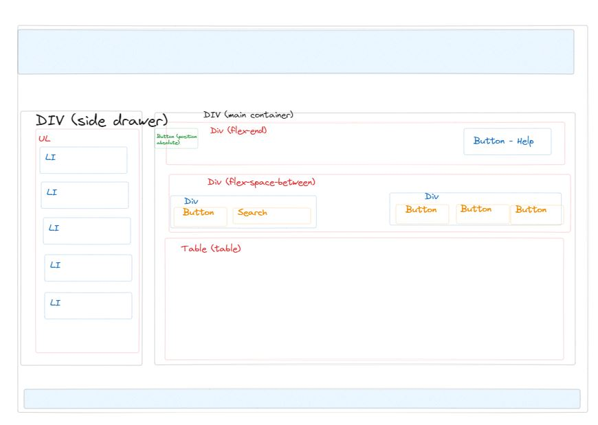

# Spectrum Mock UI Site 
Wireframe of Spectrum's Customer Relationship Management package. 

---
## Description
##### Technologies: HTML, CSS, VanillaJS, jQuery, and Bootstrap. 

The site is a quick wireframe for Spectrum's CRM software. The site has a collapsible sidebar, table, filer function, add function, and delete function. The site is responsive to all viewports. I thought the initial design given by Spectrum was too bland, so I added color and reorganized some buttons. 

---
## What I Improved

* Side Drawer is now collapsible
* Header has sandwich icon in mobile
* Table is on auto scroll which is helpful for mobile.
* Added color schemes to buttons for a better pop
* Added pseudo-classes with CSS on all buttons to make the page less stagnant
* Footer added

---
## Features

<u>Randomize</u> - list of 10 fake accounts
<u>Filter</u> - Functionality to filter the 10 accounts based off criteria
<u>Add Contact</u> - Add a contact to the list of accounts
<u>Delete Contact</u> - Delete a contact to the list of accounts

---
## Website

Github Repo: [https://github.com/nfillip/fort-collins-top-todos](https://github.com/nfillip/fort-collins-top-todos) 
Website Link: [https://foco-fun-ea270e6a24d7.herokuapp.com/](https://foco-fun-ea270e6a24d7.herokuapp.com/)

---
## Video

---
## Credits

#### Nick Fillip:  
Github: [https://github.com/nfillip](https://github.com/nfillip) 
LinkedIn: [https://www.linkedin.com/in/nicholas-fillip/](https://www.linkedin.com/in/nicholas-fillip/) 
Resume: [https://docs.google.com/document/d/1rE64RknFGj4CufIDCUFSaU_fK_mV6zbNbC2lEyJmH30/edit?usp=sharing](https://docs.google.com/document/d/1rE64RknFGj4CufIDCUFSaU_fK_mV6zbNbC2lEyJmH30/edit?usp=sharing) 

---
## Questions

**Contact Me:**
Email: [nick.m.fillip@gmail.com](nick.m.fillip@gmail.com)
Cell: (281) 216 - 2183

---
## Wireframe

---
## License

This project is under the MIT License. Please refer to the "License" file in the repo for additional information. 
© 2023 nfillip LLC. All Rights Reserved.